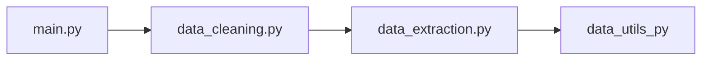

# Multinational Retail Data Centralisation

## Table of contents

1. [Project Description](#project-decription)
1. [Installation & Requirements](#installation--requirements)
1. [Usage/Examples](#usageexamples)
1. [License](#license)

## Project Decription

This project aims to produce a RDB that stores the company data of a multinational retail organisation. The data will be stored in a singel database so that it's accessed from one centralised location.

It collects this companpy data from multiple sources; an AWS RDB, s3 bucket, a pdf file etc. It then cleans that data and uploads it to a central local postgresSQL database.

In addition queries will be made against this centralised database to get up-to-date metrics of business performance.

## Installation & Requirements

### Requirements

clone git repo [link](https://github.com/ChileMathAcc/multinational-retail-data-centralisation578.git)

## File Structure

There are four primary python files in this project, each with its own unique perview.

1. ### data_utils.py

This file is reponsible for connecting to external sources of data.

It contains one class: DatabaseConnector, and four methods:

    a. read_db_cerds: Reads information off a yaml file.
    a. init_db_engine: Connects to an AWS RDB.
    a. list_db_table: Lists the tables in the above RDB.
    a. upload_to_db: Uploads tables to a local Postgres RDB

2. ### data_extraction.py

This file extracts data from varios sources.

It contains one class: DatabaseExtractor, and five methods:

    a. read_rds_table: Uses data_utils to retreive data from AWS
    a. retrieve_pdf_data: Retreives data from an S3 bucket
    a. list_number_stores: Uses an api to get the total number of stores.
    a. retreive_stores_data: Use an api to get store spesific information and aggregates it.
    a. extract_from_s3: Uses boto3 to retreive data from s3

3. ### data_cleaning.py

This file cleaning the data extracted by the above by removing NULL values and formatting data types.

It contains one class: data_cleaner, with seven methods: clean_user_data, clean_card_data, clean_store_data, convert_product_weight, clean_product_data, clean_orders_table, clean_date_details.

All these methods follow the same scheme.

4. ### main.py

The main.py file import the three other file and is reponsible for operating them in sequence.

1. ### File Dependency Structure

## Usage/Examples

Run The main.py file

## License

MIT License

Copyright (c) [2024] [Chile Mwamba]

Permission is hereby granted, free of charge, to any person obtaining a copy
of this software and associated documentation files (the "Software"), to deal
in the Software without restriction, including without limitation the rights
to use, copy, modify, merge, publish, distribute, sublicense, and/or sell
copies of the Software, and to permit persons to whom the Software is
furnished to do so, subject to the following conditions:

The above copyright notice and this permission notice shall be included in all
copies or substantial portions of the Software.

THE SOFTWARE IS PROVIDED "AS IS", WITHOUT WARRANTY OF ANY KIND, EXPRESS OR
IMPLIED, INCLUDING BUT NOT LIMITED TO THE WARRANTIES OF MERCHANTABILITY,
FITNESS FOR A PARTICULAR PURPOSE AND NONINFRINGEMENT. IN NO EVENT SHALL THE
AUTHORS OR COPYRIGHT HOLDERS BE LIABLE FOR ANY CLAIM, DAMAGES OR OTHER
LIABILITY, WHETHER IN AN ACTION OF CONTRACT, TORT OR OTHERWISE, ARISING FROM,
OUT OF OR IN CONNECTION WITH THE SOFTWARE OR THE USE OR OTHER DEALINGS IN THE
SOFTWARE.